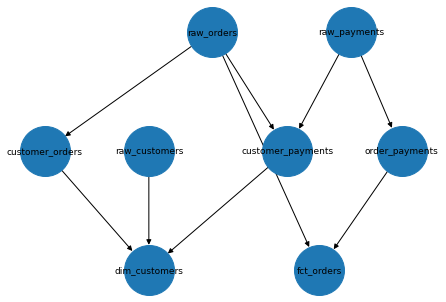

# DWH Table Dependency Grapher

Toy project to read queries that move data from raw to models tables within an ELT style data warehouse and graph the dependencies those queries create.

For example, using the example data warehouse schema from the [dbt](https://github.com/fishtown-analytics/jaffle_shop) project an interesting finding we can see is that the models `customer_orders` and `customer_payments` have no dependency on the `raw_customers` source table.

Image produced with the `example.ipynb` notebook
    

